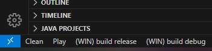

# Raylib-Project-VSCODE

Project exemple for VSCODE to compile games with Raylib


In order to work correctly, some files need to edit :

In `.vscode` directory:
--

In the file *`tasks.json`*

```json
"command": "c:/raylib/w64devkit/bin/mingw32-make.exe",
            "args": [
                "PROJECT_NAME=Explosion"
            ],
```

#### The path for all `make` command and the name of the project.

---

In the file `launch.json`:

```json
"program": "${workspaceFolder}/out/Explosion.exe",
```
#### The executable name
---


You can install a great vscode plugin to help you :


and after that, you can click on all task in the bottom left of vscode like this :


